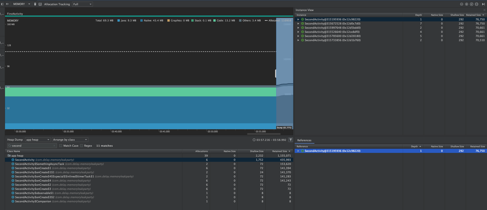
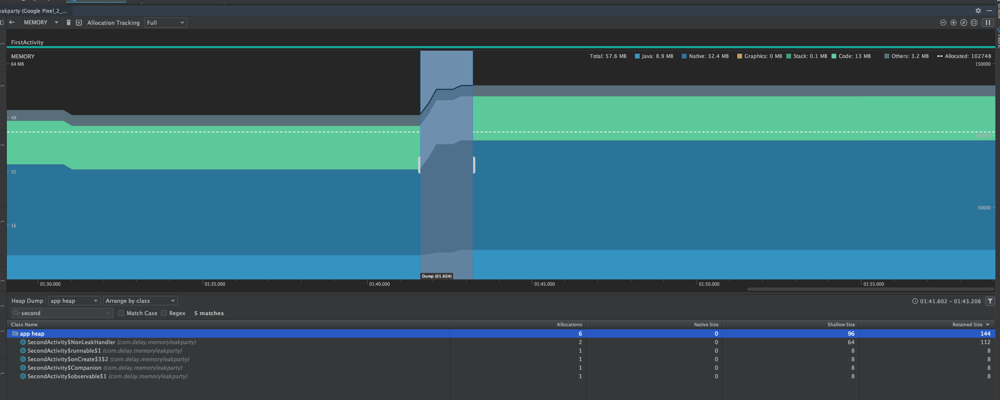

# MemoryLeakExample

Android studio 의 profiler 를 활용하여 메모리릭이 일어난 곳을 해결해볼 수 있는 예제이다.

 

## 👀 사전 단계

- [공식문서](https://developer.android.com/studio/profile/memory-profiler)를 통해 Profiler 에 대해 숙지하기
  - 추천사이트 : [Android Memory Profiler: Getting Started](https://www.raywenderlich.com/4557771-android-memory-profiler-getting-started)
- 대표적인 안드로이드 메모리릭 케이스 알아보기

 

> 테스트 환경
>
> - Android studio Emulator Pixel 2 API 29
> - Android studio Profiler

 

## 👎 메모리릭이 발생했을 경우

`SecondActicity` 가 `destroy` 되어 현재 포커스는 `FirstActivity`에 있고, 강제 gc 이벤트를 발생시켰는데도 `SecondActicity` 인스턴스가 여전히 살아있는 것을 알 수 있다. 

 , 강제 gc 이벤트를 발생시켰는데도 `Activity` 인스턴스가 여전히 살아있는 것을 알 수 있다. 

 

## 👍 메모리릭을 (나름대로) 해결한 경우

위와 달리 `SecondActicity` 인스턴스가 존재하지 않는 것을 볼 수 있다. `SecondActivity${something}` 으로 되어있는 인스턴스들은 kotlin `lambda`, `SAM` 에 의해 생성된 것으로, static field 로 처리하여 메모리릭이 발생여지가 줄어든다(사이즈도 작으니 안심해도 될 것!). kotlin 이  `lambda`, `SAM` 를 처리하는 방법에 대한 자세한 내용은 [여기](https://meetup.toast.com/posts/186)를 참고해보면 된다.

그리고 유의할점은 시간차를 두고 gc 이벤트를 발생시켜보아야한다. 메모리릭 처리를 한 후에 강제 gc 이벤트를 여러번 실행시켜도 인스턴스가 살아있는 경우가 있었다. 하지만 결국 다시해보니 사라졌다!! (메모리릭 처리 이전에는 아무리 눌러도 사라지지않았다.)

> Note : 기대하는 바로는 Deallocations 의 숫자가 올라가야하는데 왜 안올라갈까? 이건 좀 더 알아봐야겠다.

 

## 🤪 메모리릭을 해결해보자!

이 예제에 구현된 메모리릭을 유발하는 케이스는 아래와 같다. Android studio 의 profiler 를 실행하고 memory 항목을 선택하여 재현 단계에 따라 실행해보고  memory 변화를 알아보자. 그리고 메모리릭을 해결한 후에도 확인해보자!

### 테스트 케이스

1.  `Handler` 에 뷰를 참조하는 `Runnable` 작업 `postDelayed`
2.  `AsyncTask` 에서 끝나지 않는 작업
3.  compositeDisposable clear() 를 처리 하지않은 `Observable` 구독
4.  `TimerTask` 에서 delay 후  `Runnable` 작업 `schedule`

#### 재현 단계

1. `FirstActivity` 에서 kotlin memory leak 으로 `SecondActivity` 실행
2. 각 케이스별로 누르고 뒤로 누르고 뒤로 반복 (총 8회)
3. 모두 수행한 뒤, 잠시 기다렸다가(10초 이상) 강제 gc 이벤트를 여러번 실행하고 힙덤프 캡쳐

 

### 🤔 생각해보기

- 왜 `Activity` 인스턴스가 사라지지않을까?
- Instance View 탭에 표시되는 액티비티 인스턴스의 개수는 왜 많을까?
- Shallow size, Retained size 가 의미하는 것은 무엇일까?